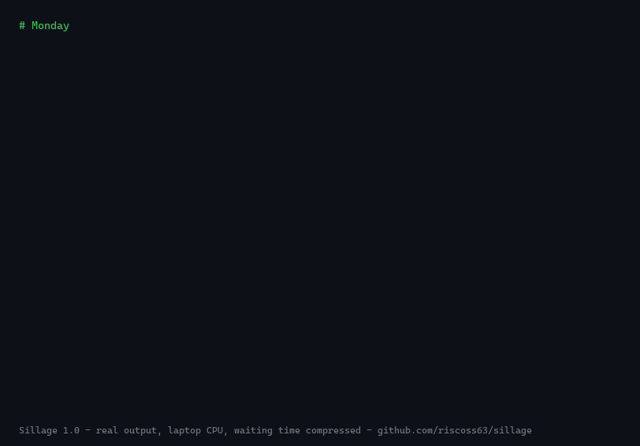
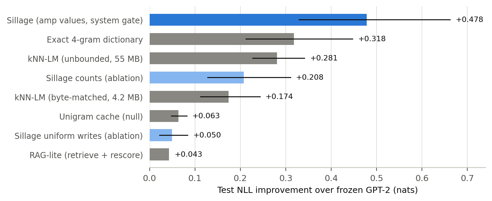
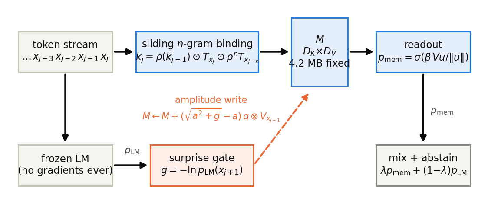

# Sillage

**Your language model forgets everything. Sillage gives it a memory — and a
way to keep learning — in a fixed handful of megabytes, with no gradients and
no datastore of hidden states that grows.**

> *sillage* (n., French) — the trace left behind by something that has passed:
> a ship's wake, a scent in a room. What a model keeps of what it read.

[](https://pypi.org/project/sillage/)
[](https://huggingface.co/spaces/riscoss/Sillage)
[](https://github.com/riscoss63/sillage/actions/workflows/tests.yml)
[](LICENSE)
[](pyproject.toml)
[](requirements.txt)
[](papers/)
[](https://doi.org/10.5281/zenodo.22079016)

A frozen LM reads your documents, remembers them, and predicts better next
time — **no gradients, no fine-tuning, no growing datastore of hidden
states**. One Hebbian matrix written as the model reads, a semantic tier
routed by confidence, a cold store
that consolidates by surprise, and a rank-16 adapter on the readout. Four
mechanisms, eight papers, **one command-line tool**. Everything runs on a
laptop CPU.

<p align="center"></p>

Two sessions, two days apart, nothing kept in context: on Tuesday the second
draft costs **half** the perplexity it would have cost on Monday (10.68 -> 5.39),
and the model completes a sentence it can only know from what it read.

**[Try it in your browser](https://huggingface.co/spaces/riscoss/Sillage)** —
no install, no account: a memory that has already read one of the papers, and
a box to feed it your own text.

---

## Quickstart (60 seconds, then a coffee)

```bash
pip install sillage                   # numpy + torch + transformers
```

```bash
sillage index notes.md                # instant: no model, already queryable
sillage ask "what did the report say?"

sillage read notes.md                 # memorize it (CPU: ~8 min per 10k tokens)
sillage complete "The report said"    # generate WITH the memory
sillage status                        # what it knows, tier by tier
```

```console
$ sillage read preprint_v1.txt                    # Monday, memory empty
read preprint_v1.txt: 5859 tokens in 4.9 min | PPL 12.14 -> 11.83 (adapter) -> 11.71 (+memory)

$ sillage read preprint_v2.md                     # Tuesday, a new process
read preprint_v2.md: 11041 tokens in 9.5 min | PPL 10.68 -> 9.82 (adapter) -> 5.39 (+memory)
memory consolidated and saved (16900 tokens lifetime, 9883 cold grams, 194 passages indexed).
```

Three numbers per file, because there are two mechanisms: what the frozen
model alone predicts, what the rank-16 adapter adds, and what the memory of
everything read so far adds on top.

The memory lives in `./.sillage` and survives restarts — it survived a power
cut during development. Its size is fixed the day you start, because the shape
of the matrices is: **7.4 MB with GPT-2** and **26.5 MB with Qwen3** (25 MiB —
the figure paper 5 quotes) — 4.2 MB of n-gram matrix, 12.6 MB of semantic tier
(on by default with `--model qwen`, opt-in elsewhere) and a `vocab x 16`
adapter that is 3.2 MB at GPT-2's vocabulary and 9.7 MB at Qwen3's;
`--sem2-whiten` adds 2-4 MB. The file on disk is compressed, so it starts
smaller and grows toward that ceiling as the matrices fill — the same after one
document or ten thousand. It **never learns from its own generations**,
only from what you give it to read.

The grounded-retrieval index (`index.json` — the verbatim passages
`sillage ask` quotes) sits beside the memory and *does* grow with what you
read. It is not what the model predicts from, and `sillage forget --all`
clears both.

Reading is the slow part, and the cost is the per-token numpy work rather
than the frozen forward pass: one forward per 1024-token window, then, at
every position, pricing the prediction against the memory and two rank-1
outer products to write it. `read --fast` drops the pricing and applies the
writes in blocks, which is where its speed-up comes from — it skips none of
them. About 8 minutes per 10k tokens with the default Qwen3-0.6B, about 2
with `--model gpt2` — which is 4x faster but English-only. `index` and `ask`
need no model at all and are instant.

### Which model can it wrap? Any of them

```bash
sillage read notes.md --model qwen                          # shortcut
sillage read notes.md --model HuggingFaceTB/SmolLM2-135M    # any hub id
sillage read notes.md --model ./my-finetuned-llama          # any local folder
```

Nothing here is model-specific: the memory only ever sees next-token logits,
one hidden state and the observed token, so **any causal language model
works** — GPT-2, Qwen, Llama, Mistral, Pythia, SmolLM, your own fine-tune.
Verified across three architectures (GPT-2, Qwen3, GPT-NeoX). Four things to
know before pointing it at a new one:

- **The readout tunes itself on an unfamiliar model.** How strongly the
  memory speaks (`beta`, `lambda`) and when it stays quiet (the abstention
  threshold) were tuned per model in the papers. For any model they did not
  tune, the tool does that tuning itself: one position in three joins a
  rolling window, the published grids are searched on it at the end of each
  read, and the winner governs the next one — so nothing is ever scored with
  settings fitted on itself. For `qwen` and `gpt2` the published settings are
  kept instead, and that is a measured decision, not deference: refitting
  them on your own cold memory *loses* (see below). `--calibrate` forces
  fitting anyway, `--no-calibrate` forbids it, `read --recalibrate` starts
  over.
- The **semantic tier stays off** for an unknown model (`--semantic` to force
  it). Paper 2 is explicit: raw hidden states need whitening except where
  their geometry is already well conditioned, and that has only been verified
  on Qwen3.
- A memory is written in **one model's token space**, so give each model its
  own `--state` directory. After that you can drop `--model`: the state
  remembers which model it belongs to, and refuses to be opened by another.
- **Cost follows the model**: reading time follows its size, and the adapter
  is `vocab x 16` floats (3.2 MB at GPT-2's vocabulary, 9.7 MB at Qwen3's).
  A 7B model on a CPU is possible but slow; this was designed for the 0.1–1B
  class. With `--device cuda` the frozen forward passes move to the GPU while
  the memory stays on the CPU, which is where the mechanisms belong: they are
  rank-1 updates, not matrix multiplications.

What calibration actually does, measured on a model the papers never touched
(Pythia 70M, two documents, second one scored out of sample):

```console
$ sillage read doc_a.txt --model EleutherAI/pythia-70m
read doc_a.txt: 5025 tokens in 1.0 min | PPL 2.02 -> 1.92 (adapter) -> 1.79 (+memory)
fitted the readout on 1675 observations from what was just read (the papers' grids):
  n-gram tier : beta 40, lambda 0.85, abstain below q75
  +0.2461 nats on that window. It governs the NEXT read, never this one,
  so no perplexity printed here was tuned on itself.
```

On the next document that fitted readout gives **1.38** where the GPT-2
defaults give 1.42 — worth having when nobody has tuned your model.

It also tracks the memory as it fills, because each fit sees a warmer memory
than the last. Reading one paper three times (GPT-2, `--calibrate`), where
the readout fitted at the end of a pass is the one that governs the next:

| pass | perplexity of this pass | what its window then fitted |
|---|---|---|
| 1 | 56.0 | `beta 20, lambda 0.1, abstain below q75` |
| 2 | 7.5 | `beta 40, lambda 0.85, abstain below q50` |
| 3 | 1.5 | `beta 40, lambda 0.85, abstain below q25` |

(Frozen GPT-2 alone stays at 68.8 throughout.)

If the `sillage` command lands outside your PATH, `python -m sillage ...`
is identical. For the papers, the reproduction pipeline and the tests, clone
the repository instead:

```bash
git clone https://github.com/riscoss63/sillage && cd sillage && pip install -e .
```

<details>
<summary><b>Use it from Python (four lines)</b></summary>

```python
from sillage import Sillage

s = Sillage(model="gpt2")          # any causal LM; omit it and the state
                                   # says which model it belongs to
s.read("notes.md")                 # read, memorize, index -- then save
s.ask("what did the report say?")  # exact passages, nothing generated
print(s.complete("The report said"))
```

`Sillage.status()` returns the same numbers as the CLI as a dict, and
`sillage.SillageMemory` is the mechanism alone (numpy only, no transformers)
if you want to wire it into your own generation loop.
</details>

<details>
<summary><b>Every option</b></summary>

| command | what it does |
|---|---|
| `sillage read FILE...` | read + memorize + index (all four mechanisms) |
| `sillage index FILE...` | index only — instant, no model needed |
| `sillage ask "..."` | grounded excerpts with their source and section (a question can name either) |
| `sillage complete "..."` | generate with the memory and the adapter |
| `sillage chat` | both, interactively (`/say`, `/read`, `/status`) |
| `sillage papers` | index the eight preprints shipped here, then ask them |
| `sillage demo FILE` | two sessions on one document, start to finish |
| `sillage serve` | OpenAI-compatible endpoint: any client gains the memory |
| `sillage watch DIR` | read a folder as it changes, ranking what it read by how unusual it looked |
| `sillage review` | what is about to be forgotten, and rereading it |
| `sillage export DIR` | a shareable state: the matrices, not your text |
| `sillage pull SRC` | open somebody else's, from a folder or the Hub |
| `sillage status` / `forget --all` | inspect / wipe |

Flags: `--model NAME` (see below), `--state DIR` (or `$SILLAGE_STATE`),
`--device cpu|cuda|mps` (a GPU is used for the frozen forward passes when
there is one; the mechanisms stay numpy on the CPU), `--no-fastweights`,
`--no-semantic`, `--half-life N` (forgetting, in tokens), `--no-calibrate` /
`read --recalibrate`, `read --fast` (paper 7's blocked write-only
ingestion: ~40x on long documents, exact cold store, declared amplitude
tolerances, no perplexity report — about half that with `--sem2`, which
pays for its keys per token), `--sem2 auto` (or a layer number, plus
`--sem2-whiten`): paper 8's semantic keys -- the tier reads an early
hidden layer instead of the last one, anchors its writes on surprising
tokens and pools the query over the prompt, which is what makes
paraphrased recall possible at all. `auto` uses the layer the papers
measured for a model they measured (qwen 1, gpt2 5) and sweeps the
network for any other, choosing the layer where a rare repeated token
still looks like itself, `--cold-mass` (weight the cold store's successors by
surprise mass -- paper 6's adversarial fix; counts stay the default and
reproduce the papers' numbers), `--dtype float32|bfloat16|float16|int8`
(quantise the frozen model so a bigger one fits -- the tool prints what
each one was measured to cost, see below), `-n`, `--temp`, `-k`, and on
`complete`/`chat`: `--fast` (speculative decoding from the memory --
identical output, greedy only) and `--target NAME` (a bigger
same-tokenizer sibling reads the state; adapter off).

Three flags exist because a measurement asked for them. `read --reflow`
joins the lines inside each paragraph before reading: both fast tiers key
on the last four **tokens**, and a line break is absorbed *into* a token,
so a document that wraps `responsable,` / `madame` stores a key the same
sentence typed on one line can never form. Measured on a French report,
questions typed the way a person types them: **7/8 facts as the document
wraps them, 8/8 reflowed** ([here](results/reflow.json)). It is opt-in
because it changes the token stream, so a reflowed read's perplexity is
not comparable to the published numbers. `--readout published|family|b,l,q`
exposes the three constants that decide how loudly the memory speaks;
`family` is paper 5's `40,0.85,0.5`. And `complete` now prints, to
stderr, what the memory actually contributed -- `[memory moved 9/12
tokens; tiers spoke: cold 8, ngram 7]`, or a warning when it moved fewer
than three, which on two corpora and 36 questions caught **11 of the 12
questions the documents could not answer** while no correct answer ever
moved fewer than 12.

`--cold-max N` is the capacity dial. The exact store keeps N 4-grams at
about 42 bytes each, which measures out at roughly **40 pages of durable
memory per megabyte**; when it overflows it keeps the highest surprise
mass, and that was measured to drop **38 % of a store without losing one
of 294 planted facts** ([here](results/eviction.json)). Recall itself is
flat from 5,850 to 1,000,107 tokens, with the locality perturbation
exactly zero at every scale ([here](results/capacity.json)).

What fills it is not tokens but *repeated* 4-grams, so the same document
costs very different amounts depending on how you read it: real prose
repeats only ~6 % of its own grams, so one read fills the store after
~890k tokens and retains almost nothing, while reading twice -- what
paper 6 tells you to do -- fills it after ~56k and retains everything
distinct, a figure stable within 5 % across ten independent texts
([here](results/gramrate.json)). **Durability and capacity are the same
budget.**

Globs are expanded by the tool
itself, so `sillage read docs/*.md` works on Windows too.
</details>

---

## How much better, exactly?

On 36k tokens of technical text the model had never seen (frozen GPT-2 124M,
every system tuned identically on a held-out prefix, 95 % bootstrap CIs):

| system | perplexity | change | memory used |
|---|---|---|---|
| frozen GPT-2 | 31.2 | — | 0 |
| \+ RAG-style retrieve & rescore | 29.9 | −4 % | corpus + index |
| \+ kNN-LM, **unbounded** store | 23.6 | −24 % | 55 MB, grows forever |
| \+ **this memory** (fixed) | **19.2** | **−38 %** | **4.2 MB, constant** |
| \+ memory **and** fast weights | **16.8** | **−46 %** | 7.4 MB, constant |

(The last row is the rank-16 adapter the tool actually ships,
[measured](results/fwscale_bhd.json); paper 4's +0.633-nat headline uses
the dev-selected rank-256 adapter — 51 MB of adapter for the last 0.015
nats (perplexity 16.8 -> 16.6).)

The fixed 4.2 MB memory beats the unbounded datastore it was designed to
approximate — paired bootstrap **P = 1.000**
([committed](results/paired_bhd_v3_vs_knn.json)), replicated over 5 random
seeds. On a second model (Qwen3-0.6B) it **statistically matches** that
unbounded store at one-sixteenth the memory (paired CI [−0.08, +0.06] nats —
parity, not a win; the internal orderings all replicate). And the gains show
up in behaviour, not just likelihood: recall of recurring technical terms
(word types already seen ≥ 2 times) after one reading pass goes from
**11.3 % to 23.7 %** (McNemar 261:14).

<p align="center"></p>

The same state also pays in **speed**. Used as a drafter for speculative
decoding, it accelerates its own model and -- after two minutes of
read-only calibration -- its bigger tokenizer-siblings, with output
identical to normal greedy decoding: **x1.63 on Qwen3-0.6B, x1.98 on
1.7B, x1.86 on 4B** (T4, 70-87 % of drafted tokens accepted), while on
text it never read the drafter abstains and costs nothing (x0.97-1.09).
And the state transfers: the 0.6B reads the documents once, and the 4B --
which read nothing -- recalls them. Paper 5 measures the whole loop,
controls and negative results included ([`spec/`](spec/),
[results](results/)). The tool ships both: `sillage complete "..." --fast`
(speculative, identical output) and `--target Qwen/Qwen3-1.7B` (a bigger
same-tokenizer sibling reading this state).

And the behavior is mapped, law by law (paper 6): recall converts through
the readout's TRUST in the memory (a 20% conflict-resolution plateau
jumps to 100% on the same state when the mixing weight rises); the
Hebbian matrix is working memory while the consolidated cold store is
the durable one (97% fact recall after 110k tokens of interference, with
or without forgetting); and **the system durably remembers what it has
seen twice** -- the cold store's admission threshold, become a
behavioral law. Adversarial bulk attacks self-neutralize through the
surprise gate; the residual channel motivates `--cold-mass` below.

One of those laws has since been **amended by its own repair** (paper 8):
paraphrased questions used to recall nothing at all, because the semantic
tier was keyed on the last hidden layer -- the one place where a
next-token model has already erased *who* is being discussed (identity
decays monotonically with depth; GPT-2's final layer is even
anti-correlated). Key that tier on an early layer instead, anchor its
writes on surprising tokens and pool the query over the prompt, and
rephrased recall goes from **0% to 80% on Qwen3-0.6B and 30% on GPT-2**
in this tool -- paired control, held-out facts, witness locality 0-1/10.
That is `--sem2 auto` below (or `--sem2 LAYER` to name the layer
yourself). Read the locality figure for what it is: it is the paper-8
benchmark's own witnesses under `--sem2`, not a general statement about
generation. On the default path, reading an unrelated document *did*
change a completion in a later trial — the number it emitted for a
remembered fact changed, though nothing from the unrelated document
appeared. Perplexity locality is solid (0.3% movement on an unrelated
document); generative locality is not the same claim.

## Put it behind your usual client — `sillage serve`

```bash
sillage read ~/notes/*.md --fast      # memorize a folder
sillage serve                         # http://127.0.0.1:8000/v1
```

Point any OpenAI-compatible client at it (Open WebUI, continue.dev, the
`openai` package, plain `curl`) and it gains the memory of what you read —
no plugin, no integration, and **no dependency beyond the three above**:
this is the standard library's HTTP server, because a local single-user
service does not need a web framework.

```console
$ curl -s localhost:8000/v1/chat/completions -d \
    '{"messages":[{"role":"user","content":"What does the Zylkorb protocol require?"}]}'
{"choices":[{"message":{"content":" seventeen turquoise brackets ..."}}],
 "sillage":{"sources":[{"source":"field-notes.md","score":0.61}], "seconds":1.3}}
```

Two mechanisms are on, and each is there because paper 7 measured what it
is worth. **The passages your question matches are put in the prompt**,
with their source — on LongMemEval the memory answering alone reached 5%
where the same evidence in the window reached 25%, so that is where the
evidence goes. **The memory also mixes into the model's own next-token
distribution**, which is what recalls your exact wording; the same paper
measured that this never hurts when the evidence is already in the window
(identical answers on 40 of 40 questions). Every reply names the sources
it used, in the `sillage` field and in the `X-Sillage-Sources` header — a
service that rewrites your prompt in silence would not be auditable.

**What this composition is worth, and what it costs**, asked of the real
endpoint over real sockets with `--no-context` as the ablation
([measured](results/serve_rephrase.json)):

| | rephrased questions | refuses | fabricates |
|---|---|---|---|
| 0.6B, passages injected | **8/8** | 2/8 | 6/8 |
| 0.6B, `--no-context` | 0/8 | 1/8 | 7/8 |
| **1.7B** (`--target`), injected | 7/8 | **5/8** | **3/8** |

Eight rephrased questions out of eight, in correct French, on a CPU, from
a 0.6B — and **0/8 from the same model with the passages withheld**, which
is paper 7's split replaying exactly: the memory alone does not
formulate, the same evidence placed in the window does. That is why the
readout's own weakness on rephrasing (see the negative results) does not
reach you here.

The cost is the row on the right. Putting passages in the window pushes
the model to answer *everything*, including what the passages do not
support: `--no-context` refuses far more often. The system note tells it
to say when the notes do not contain the answer, and on a 0.6B it obeys
twice in eight — a real gain over none, and not a fix. **The one thing
that halves it is a bigger reader**: `--target Qwen/Qwen3-1.7B` drops
fabrication 6/8 → 3/8 and more than doubles refusals. It does not
remember better — 7/8 against 8/8 — it lies less. Over this endpoint,
trust the **sources** it names, and read the prose as a draft.

Reading a folder does not block the conversation: `POST /read` returns a
task id and the ingestion hands the state's lock back every 32 tokens, so
answers keep coming while it works. Measured on a single-window document
(gpt2, `behav/probe_serve_midread.py`): replies in **4.35 / 2.72 / 2.74 s
during the read against a 1.90 s idle baseline** — 2.3x at worst. Until
1.8.2 the lock was only released at 1024-token window boundaries, so a
document that fitted in one window offered no yield point at all and a
real conversation stalled for the whole read; that is what the number
above replaces. What remains, said plainly: those yield points are in the
*write* loop, and the frozen forward pass at the top of each window — up
to 1024 tokens at once — still holds the lock and cannot be interrupted.
A request arriving during one waits **11–25 s**. That is the floor of the
design, not a bug. Other endpoints: `/status`, `/ask` (grounded passages, no
model), `/tasks/<id>`, `/v1/models`, `/v1/completions`, and `stream: true`,
which since 1.8.3 emits each token as it is produced (first frame at
0.36 s of a 2.35 s answer, byte-identical to the non-streamed reply) —
before that the whole answer was generated and then chopped on spaces,
so every frame landed at the end.

It binds to `127.0.0.1`. **This memory contains the text you fed it** —
`--host 0.0.0.0` is possible, says so out loud, and `--token` adds a
bearer check.

## Four commands only this mechanism can offer, and one honest negative

**`sillage watch ~/notes`** reads a folder as it changes, and keeps a
**salience journal**: every write is already scaled by the frozen model's
own surprise, so a per-document measure of how *unusual* your prose looks
to the model comes free — where a note-taking app pays an LLM call per
decision. It is a real signal and it is not the one you might hope for:
it ranks density and jargon, not novelty. On a folder holding one page of
invented facts and one of a single sentence repeated forty times, the
separation is **1.48 nats against 0.17**, a factor of nine — but that
control is as easy as a control gets, and on real French notes the same
comparison gave 2.56 against 2.14, a factor of 1.20. Read the number for
what it is: the
frozen model's surprise, measured before the memory speaks, averaged per
token. It ranks unusual, dense prose. It cannot say "new to *this*
memory" (re-reading a file the memory already holds scores identically),
and because it is a mean, appending new material to a long note *lowers*
its score. And because paper 6 showed that a document read twice is what
crosses the durability threshold, watching a folder *is* the mechanism,
not a convenience around it.

**`sillage review`** turns that law into a command: for every document,
how many of its 4-grams are consolidated (seen twice, so the memory can
speak them), fragile (seen once — stored, but under the threshold, so
silent), or gone. Read a document once and it comes out ~52% consolidated
with a hundred-odd fragile grams; read it twice and it is 94% with none.
`--read N` rereads the weakest.

**`sillage export cartridge/`** writes a state you can hand to someone
else. The cold store (4-grams to successors, in plain token ids) and the
index (verbatim passages) are left out, because either one hands your
text back; what ships is the matrices, which are superpositions.
Measured cost of leaving them out, on the same state: perplexity
unchanged (1.20 → 1.19), canonical recall 9/10 → 7/10, and **paraphrased
recall untouched at 8/10** — the capability paper 8 unlocked survives
sharing. The command refuses to be quiet about two things: it warns when
a state is too thin for its tiers to speak at all (they abstain below 500
scored positions, and the cartridge would be silent), and its manifest
states plainly that *no plain text* is not the same claim as
*anonymous* — inverting a superposition is hard, not proven impossible,
and no inversion attack has been run against this format yet.

**`sillage pull user/cartridge`** is the other end of that trip: a
folder, or any Hugging Face repo with a `cartridge.json` at its root,
opened as your state — then read your own documents on top and they
consolidate normally, next to what you pulled. It fetches the three
files a cartridge is made of *by name*, never a whole repository, and
refuses twice rather than warning: it will not replace a memory you
already have without `--force`, and it will not open a pre-1.5 pickle at
all. Your own states migrate from pickle with a warning; unpickling
executes code, and a downloaded state is not one you created.

**`--dtype int8|bfloat16`** quantises the frozen model so a bigger one
fits in the same RAM. It is not a speed knob, and the tool says so
itself at load time, because both halves were measured on Qwen3-0.6B
against float32 with the thresholds declared before the run:

| dtype | surprise gate | cold admissions | recall | reading |
|---|---|---|---|---|
| `bfloat16` | r = **1.0000** (0.0045 nats apart) | 483 vs 483, Jaccard 1.00 | identical | **4x slower** (emulated on this CPU) |
| `int8` | r = **0.9735** — under the 0.98 declared | 483 vs 483, Jaccard 1.00 | **5/7 -> 1/7** | no faster |

So: float32 stays the default on CPU, `bfloat16` is faithful and is for
when *memory* is the constraint, `int8` is for making a bigger model fit
at all — not for anything you care about recalling. This is what replaced
the llama.cpp backend the roadmap had planned: paper 8 made that
untenable, since the semantic tier now keys on an *early hidden layer*
and GGUF runtimes do not expose intermediate layers.

## Should you use this?

| your situation | better option |
|---|---|
| One machine, private documents, must run offline | **this** |
| The model must keep learning after deployment, forever, at bounded cost | **this** |
| You can afford a datastore that grows with everything you read | kNN-LM / RAG |
| You need the model to *reason* better, not to *remember* better | fine-tuning |
| The document fits in the context window and you only read it once | just paste it |

It is a **memory**, not an intelligence upgrade: it makes a model better at
the text in front of it, on a fixed byte budget, forever.

---

## How it works, in four ideas

<p align="center"></p>

1. **Keys by binding.** Each position is addressed by a sliding *n*-gram
   product of random token hypervectors — a key that fires on exact
   repetition and stays near-orthogonal otherwise.
2. **Values as amplitudes.** The matrix stores *square roots* of accumulated
   mass, not counts. That one change roughly doubles the memory's benefit:
   square-root compression stops frequent continuations from drowning rare
   ones in superposition.
3. **Surprise decides.** Every write is scaled by the model's own token
   surprise `−ln p_LM` — free at inference. The same scalar also arbitrates
   which tier answers, and which patterns get consolidated to cold storage.
4. **Fast weights adapt what memory cannot.** A rank-16 delta-rule adapter on
   the readout (3.2 MB, no error transported through any layer) wins exactly
   where memory is weakest, and their gains add up (89–98 % additive).

### Papers 1–4 are the four mechanisms — all of them are in the tool.
### Paper 5 is what the state does next: recall for the family, and speed

| paper | mechanism in `sillage/` | on by default | switch |
|---|---|---|---|
| 1 · Sillage | `M_G`, 4.2 MB Hebbian *n*-gram tier, amplitude writes, surprise gate | yes | — |
| 2 · Router | `M_S`, 12.6 MB semantic tier, **score-level** mixing with abstention | `--model qwen` only (other models need whitening) | `--semantic` / `--no-semantic` |
| 3 · Hierarchy | cold store of exact 4-grams, consolidated by surprise **mass** at save time | yes | — |
| 4 · Fast weights | `A`, rank-16 delta-rule readout adapter, uniform step | yes | `--no-fastweights` |
| 5 · Drafter | speculative decoding from the state, and cross-model recall in the family | no | `complete --fast`, `--target NAME` |
| 1 & 3 · long horizons | leaky forgetting (half-life in tokens) | no — needed past ~0.5 writes/parameter | `--half-life 100000` |
| all four · protocol | readout **calibration**: the papers' grids fitted on a rolling window of what you just read, governing the next read | only for a model the papers did not tune | `--calibrate` / `--no-calibrate`, `read --recalibrate` |

`sillage status` shows both of the last two lines: which readout is in force
right now, and how close the matrix is to saturation — the capacity law being
the honest limit of the whole approach.

## The eight preprints

Papers 1-6 are archived on Zenodo with permanent DOIs (7 and 8 are in submission); the LaTeX sources and figures are in [`papers/`](papers/). `sillage papers` indexes them so you can query them offline.

| # | title | the finding |
|---|---|---|
| 1 | **[Sillage](https://doi.org/10.5281/zenodo.22079016)** · [source](papers/sillage/sillage.tex) | a fixed 4.2 MB Hebbian cache beats an unbounded kNN-LM on novel repetitive text |
| 2 | **[Route the Scores, Not the Keys](https://doi.org/10.5281/zenodo.22079444)** · [source](papers/router/router.tex) | gradient-free semantic keys work — but only if you mix at the score level, never in the key |
| 3 | **[One Signal, Three Tiers](https://doi.org/10.5281/zenodo.22079471)** · [source](papers/hierarchy/hierarchy.tex) | consolidating by *surprise mass* keeps 92–94 % of a cold store's value with 10 % of its entries (500k streams) |
| 4 | **[Memory Remembers, Fast Weights Adapt](https://doi.org/10.5281/zenodo.22079481)** · [source](papers/fastweights/fastweights.tex) | two gradient-free mechanisms, opposite regimes, near-additive gains |
| 5 | **[The Memory Pays for Itself](https://doi.org/10.5281/zenodo.22109220)** · [source](papers/drafter/drafter.tex) | the same state recalls documents across a model family and speculatively accelerates it (x1.6-2.0, output-identical) |
| 6 | **[Stored Is Not Recalled](https://doi.org/10.5281/zenodo.22125859)** · [source](papers/behavior/behavior.tex) | six behavioral laws with mechanisms: trust governs recall, the cold store is the durable memory, and the system remembers what it saw twice -- v2 adds the capacity test (the laws are flat across x6.7 the reader) |
| 7 | **Found Is Not Formulated** (DOI pending) · [source](papers/benchmark/benchmark.tex) | LongMemEval, judge-free: the index finds the evidence for 92.6% of 500 questions, formulation stays in the window (memory exactly neutral in RAG, 40/40), and blocked ingestion runs x43 |
| 8 | **The Key Was in the Wrong Layer** (DOI pending) · [source](papers/paraphrase/paraphrase.tex) | the paraphrase wall falls: entity identity decays monotonically with depth (final layer: zero on Qwen3, negative on GPT-2), and early-layer keys + surprise anchors + query pooling take generative paraphrase recall from 0% to 55-60% on two models |

## What did *not* work (and how we know)

This is the part most repositories leave out.

- **Hidden states make terrible Hebbian keys.** Their similarity geometry is
  too entangled (95th-percentile cosine 0.94 between random pairs,
  [measured](results/semantic_diag_bhd.json)); the best semantic-only
  configuration reached 8 % of the *n*-gram key's gain and was harmful
  off-domain.
- **Surprise gating helps memory and *hurts* fast weights** (−18 % on one
  stream, −100 % on another). The delta rule already carries its own error
  term; gating double-counts it. Gate the mechanisms that cannot see their own
  error; leave alone the ones that can.
- **Two evaluation bugs shipped before any result did.** Raw Gutenberg `\r\n`
  endings inflated every method by **+1.35 phantom nats**; a one-position
  misalignment made the RAG baseline score at chance. Both were caught by
  controls, not by luck.
- **The paper-8 tier is not free in the fast path.** Blocking its writes was
  predicted to buy **≥x3** and bought **x1.9**. The profile says why: the fast
  path reads 270 tok/s without the tier, 143 with it and 109 with
  `--sem2-whiten`, because keying an early layer and accumulating a covariance
  are per-token costs that blocking cannot remove. 143 tok/s is still x15-20
  over a normal read's 7 — but the ~40x headline holds *without* `--sem2`, not
  with it. Registered before the run in `behav/JOURNAL.md` (experiment C2),
  and refuted by it.
- **A revised document does not supersede the one it revises.** Read a note
  saying the alert threshold is 40 degrees, then a note saying it was raised
  to 55, each twice: `ask` returns **both**, a thousandth of a point apart
  (0.046 and 0.045), with the withdrawn one first; `complete` says 40.
  Paper 6's conflict curve measured how many rereads flip a *generation*;
  nothing in the retrieval layer knows that one document withdraws another,
  and on two short documents the scores cannot even order them meaningfully.
  Returning both is the honest behaviour and it is what the tool does — but
  it means **you** are the one who notices the contradiction. If you keep a
  value that changes, edit the note rather than adding a second one.
- **The memory can move a real fact onto a question it cannot answer.**
  Asked to continue *"la prochaine visite de l'inspection régionale aura
  lieu le"* — no visit is mentioned anywhere in what was read — the tool
  answered **"14 juin"**, which is the *signature date* of the report it had
  read, followed by a clause spliced verbatim from it. The empty-state
  control answers "1er janvier 2024", so the specific false date is the
  memory's contribution. This is the sharpest form of "never a source of
  truth": the generation is wrong in a way that *looks* sourced. Use
  `sillage ask`, which returns the passage or nothing.
- **A bigger model does not fix rephrased questions — and neither does
  the chat template.** The obvious hypothesis was that the 0.6B simply
  cannot answer in a document's register, so a larger one would bridge a
  question back to the surface the memory keys on. Measured on four arms
  of one document, it is the reverse: rephrased recall is 2/8 and 3/8 at
  0.6B, and **0/8 at 1.7B** under both readouts, because `complete`
  encodes the prompt raw and a base model handed a question continues the
  genre — the 1.7B wrote more questions 7 times out of 8. Running the
  same questions through the model's chat template removes that echo
  entirely (7/8 → 0/8) and still answers **0/8**, while making the memory
  intrude *more* (see the serve caveat above). Rephrasing is not a
  capacity problem and not an interface problem: both fast tiers key on
  surface, and no model size changes that
  ([bridge](results/bridge.json), [template](results/chattemplate.json)).
  For a question today, `ask` is the door: 12/12 at the entry, verbatim,
  sourced, nothing generated.
- **Turning the readout up does not buy recall at 0.6B, and costs
  locality thirteen-fold.** Paper 5's "family" settings (`40,0.85,0.5`)
  convert 10 % of conflicts into 100 % on the paper's own synthetic
  protocol, so they looked like the dial that would make `complete`
  answer. On an ordinary French report they buy **nothing** at 0.6B --
  88 % both ways -- while the perturbation on a document the memory never
  read goes from **+0.16 to +2.14 nats**. At 1.7B the picture reverses:
  the published readout is too quiet (75 %) and family recovers the 13
  points at +1.25 nats. Either way it makes the memory speak **3 to 13
  times more on questions it cannot answer**, which is the wrong
  direction. `published` stays the default; the flag exists so the
  trade-off is yours to make ([0.6B](results/readout_dial_06b.json),
  [1.7B](results/readout_dial_17b.json)).
- **And no available signal separates that case from a correct answer.**
  A second corpus reproduced it and pinned it down with two twin
  questions on the same document. *"La visite de printemps du rucher
  s'est deroulee le"* is answered `11 avril 2026, par temps couvert` --
  **correct**. *"La prochaine visite du rucher aura lieu le"* is answered
  `11 avril 2026, par temps couvert` -- **the visit that already
  happened**. Same output, same 16 of 30 tokens moved by the memory, both
  verbatim from the document, and TF-IDF scores of 0.62 and 0.55 when
  correct answers span 0.245-0.623. Three candidate guards were
  registered and all three failed
  ([measured](results/crosscheck.json)): the lexical channel does not
  abstain, the text is genuinely verbatim, and making the two channels
  audit each other does not work because **both are surface matchers and
  they fail together**. The only thing separating the two questions is
  the word *prochaine*, which is nowhere in the document. This is a
  boundary, not a bug: it needs knowing that a next visit is not a past
  one, which no bag of words can do. What the tool does instead is bound
  it -- the class only touches questions whose wording nearly covers a
  stored passage, and the faint-contribution guard below catches
  everything else.
- **Paper 8's 0 % -> 80 % does not transfer to ordinary notes, and the tier
  is far harder to switch on than the paper suggests.** Two things were
  measured by replaying five real sessions. First, the cost of entry: the
  tier anchors only on surprising positions and abstains until it has 500
  of them, and that reservoir fills at **1–2 % of the tokens read** — six
  positions per 576-token pass, dead linear. A 576-token note therefore
  needs **84 rereads (48k tokens)** before the tier says anything at all,
  and a 3.5k-token vault gets 81 of the 500 on a first pass. Until then
  `--sem2 auto` behaves exactly as if it were off, which is why two trials
  measured "0/10" and concluded the paper did not reproduce; `status`,
  `read` and `watch` now all say so. Second, and this is the part that
  matters: **once the tier is provably speaking, rephrased recall is 1/10
  on a 576-token French note (against 0/10 for the matched control) and
  0/10 on a vault of eight notes.** The mechanism is real and attributable —
  the control separates — but the 80 % figure belongs to the paper's own
  instrument (a purpose-built dossier of invented facts, its own prefixes,
  its own dev/test split) and does not carry to arbitrary prose. Treat
  `--sem2` as a research setting, not a feature.
- **Self-calibration loses to a proper tuning, where one exists.** Fitting the
  readout on your own stream sounds strictly better than using someone else's
  constants. It is not: the window is read by a memory that is *colder* than
  the one those settings will govern, so the fit comes out systematically too
  timid. Measured on GPT-2, fitting on one technical paper and scoring on the
  next (gain over the frozen model, in nats):

  | readout fitted on | gain on the next paper |
  |---|---|
  | the whole window | +0.098 |
  | its recent half | +0.103 |
  | its recent quarter | +0.109 |
  | **the papers' published settings** | **+0.120** |
  | an oracle fitted on that paper itself | +0.125 |

  Recency helps, and never enough. Hence the rule the tool follows: calibrate
  a model nobody has tuned, and keep the published constants for the two that
  were tuned properly — on 36k–500k-token streams, not on a few thousand cold
  ones.

  (Provenance note: this table, the Pythia and three-pass examples above,
  and the quickstart transcripts are replayable CLI sessions of the shipped
  tool, reported as transcripts. Every number in the results tables and the
  eight papers is committed as JSON in [`results/`](results/); these
  illustrative CLI numbers are not, and will vary slightly with your
  documents.)

Hence the three controls we now consider mandatory for streaming-memory work —
`python eval/diagnostic.py` runs them: a **shuffled-retrieval null** (replace
retrieved values with random tokens; any surviving gain is an artifact), a
**unigram-cache null**, and a **base-model sanity perplexity**.

---

## Reproducing everything

Every number in every paper regenerates from these scripts with fixed seeds,
on CPU. See **[REPRODUCE.md](REPRODUCE.md)** for the full pipeline; results
are committed as JSON in [`results/`](results/) (including per-seed values).
`python test_unit.py` checks the mechanisms themselves in five seconds (18
checks, numpy only, no model: retrieval, the square-root rule, forgetting, the
delta rule, consolidation, blocked ingestion, the semantic keys and their
automatic layer choice, the pickle-free state round-trip, the JSON index, the
readout tuner, the multi-model paths); `python test_sillage.py` runs 14
end-to-end tests of the tool (each command in its own process, invented facts
the base model cannot know); `python test_serve.py` starts the HTTP service and
talks to it over real sockets (16 checks: an OpenAI client, a background
ingestion answering mid-read, a stream that arrives while it is generated,
refusals, and the bearer token); and `python test_axis4.py` covers watch,
review, export and pull (25 checks, including the cartridge round-trip and
its refusals). **80 checks**, all green on the shipped 1.9.2.

<details>
<summary><b>Repository layout</b></summary>

```
sillage/         the tool: core.py (the four mechanisms), runtime.py,
                 index.py (grounded retrieval), ingest.py (fast reads),
                 drafting.py (speculative), serve.py (HTTP),
                 watch.py (the folder walk and salience journal), cli.py
pyproject.toml   packaging: pip install -e . gives you the `sillage` command
test_unit.py     the mechanisms, in five seconds, numpy only
test_sillage.py  the tool, end to end, in its own processes
test_serve.py    the HTTP service, over real sockets
test_axis4.py    watch, review, export and pull, with the laws they rest on
.github/         CI: the unit tests and a LaTeX check on every push
papers/          the eight preprints (LaTeX + figures)
results/         every number in every paper (JSON)
pipeline/        corpora and frozen-LM passes          \
memory/          the memory systems (papers 1-3)        |  paper
fastweights/     the readout adapter (paper 4)          |  reproduction
spec/            the speculative drafter (paper 5)      |
behav/           the behavioral suite (papers 6, 8)     |
longmemeval/     the external benchmark (paper 7)       |
eval/            evaluations, controls, diagnostics     |
figures/         figure generation                     /
data/ dumps/     regenerable artifacts (gitignored, ~2 GB)
```

Version 1.0 merged the two former scripts into one tool: `assistant.py` →
`sillage read` / `complete`, `papers_assistant.py` → `sillage papers` / `ask`,
`demo.py` → `sillage demo`. Old `memory_state/` directories are still read.
The papers 1-4 pipeline (`pipeline/`, `memory/`, `fastweights/`, `eval/` and
`figures/make_figures*.py` through p4) keeps a bootstrap header that resolves
the repo root and `chdir`s to it, so `data/`, `dumps/` and `results/` always
resolve identically. The `spec/`, `behav/` and `longmemeval/` scripts and
figures p5-p8 resolve paths from their own directory and write into
`spec/results/`, `behav/results/` and `longmemeval/results/`, which are
gitignored; the committed copies under `results/` are promoted — `behav/`
outputs gain a `behav_` prefix (`behav/results/retention_gpt2.json` →
`results/behav_retention_gpt2.json`), `longmemeval` keeps its `lme_*` names,
and `spec/`'s become `drafter_*`.
</details>

<details>
<summary><b>Caveats worth knowing before you try it</b></summary>

- The papers' numbers were measured on two frozen models (GPT-2 124M,
  Qwen3-0.6B) at CPU scale. The tool accepts any causal LM and calibrates
  its readout for it, but nothing here has been measured above 1B parameters,
  and the semantic tier has only been validated on Qwen3.
- The memory captures **surface repetition**; paraphrase recall is what the
  semantic tier partially addresses, and it remains the open frontier.
- A fixed matrix saturates at long horizons (~0.5 writes per parameter);
  forgetting (×2.3, `--half-life`) and capacity (×3.4) are the measured
  remedies.
- `sillage forget <file>` removes a document from the index, not from the
  matrices: Hebbian traces are superposed, so only `--all` or forgetting
  removes those. The tool says so rather than pretending otherwise.
- **A state is data, not code.** Every part of it (`state.npz`,
  `cold.npz`, `calib.npz`, `index.json`, `log.json`) loads with
  `allow_pickle=False` or as JSON, so opening someone else's `--state`
  cannot execute anything. States written before 1.5 were pickles; they
  migrate on first open, with a warning, and the pickle is deleted once
  rewritten (`SILLAGE_NO_PICKLE=1` refuses the migration instead).
  Note that a cold store still *reveals the text it read* — that is a
  confidentiality matter, not a code-execution one.
- The papers' *Manuscripts* stream (unpublished drafts) is not redistributed —
  drop your own documents in `manuscripts/` to run that protocol.
</details>

## Citation

```bibtex
@article{sghairi2026sillage,
  title  = {Sillage: Surprise-Gated Amplitude Memory
            for Frozen Language Models},
  author = {Sghairi, Abderrahmane},
  year   = {2026},
  doi    = {10.5281/zenodo.22079016},
  url    = {https://doi.org/10.5281/zenodo.22079016}
}
```

MIT licensed. Issues and questions welcome.
